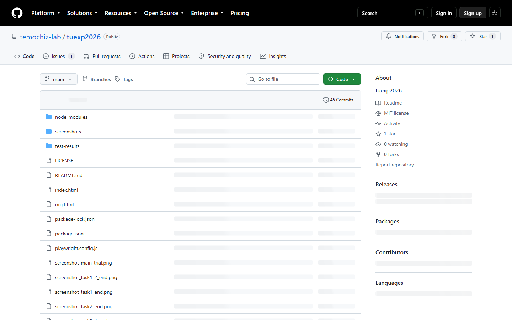

# 文字サイズと色の変更について

この実験では、`index.html` の設定ブロックで色名の文字サイズと色を変更できます。

```javascript
// =========================================
// 表示する色のサイズと実際の色はここで設定します
// =========================================
```

## 1. GitからZIPをダウンロードする

GitHubのリポジトリページを開き、緑色の **Code** ボタンを押して、**Download ZIP** を選びます。



リポジトリ：<https://github.com/temochiz-lab/tuexp2026>

## 2. ローカルPCで展開する

ダウンロードしたZIPファイルを、デスクトップなど分かりやすい場所に移動します。ZIPファイルを右クリックして **すべて展開** を選び、展開先を指定します。

例：

```text
デスクトップ\tuexp2026-main\
```

## 3. エディタで開く

Visual Studio Code（VS Code）などのエディタで、展開したフォルダを開きます。`index.html` を開いて、次の設定ブロックを探してください。

```javascript
// =========================================
// 表示する色のサイズと実際の色はここで設定します
// =========================================
// ...
const selectCol = [
    {str: colorNames[0], col: 'red', id: 1},
    {str: colorNames[1], col: 'blue', id: 2},
    {str: colorNames[2], col: 'green', id: 3},
];

const fontSize1 = 36;
// =========================================
// ここまで
// =========================================
```

`fontSize1` の数字を変更すると、刺激として表示される色名と、色名の選択肢の文字サイズが変わります。単位はpxです。

`selectCol` の `col` を変更すると、色名や色パッチに使う実際の色を変更できます。現在は `red`、`blue`、`green` です。

表示文字を切り替える場合は、URLに `script=kanji` を付けます。省略するとひらがな表示です。

```text
index.html?task=1&script=kanji
```

## 4. 保存してローカルでテストする

変更した `index.html` を保存し、ファイルをエクスプローラーからダブルクリックしてブラウザで開きます。実験参加者IDなどを入力して、色名の大きさや色が意図どおりか確認します。

複数タスクを短時間で確認する場合は、次のようなURLが便利です。

```text
index.html?task=1,2&trials=3&practice=3
```

## 5. 調整内容を共有する

テストして決めた `fontSize1` の値や色の変更内容を伝えてください。こちらでGitの本体に登録すると、GitHub Pagesのオンライン版にも反映され、参加者全員が同じ設定で使えるようになります。

設定を変更する前に、元の値をメモしておくと、元に戻したいときに安心です。
